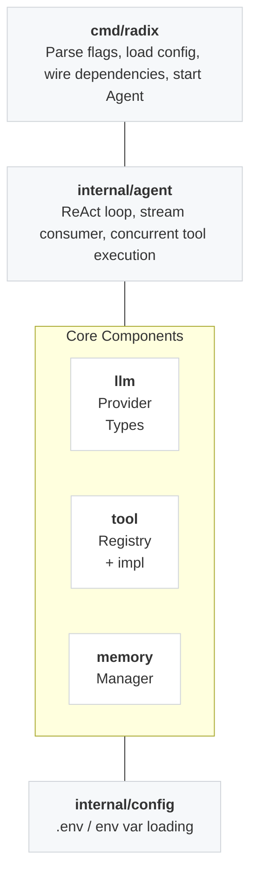
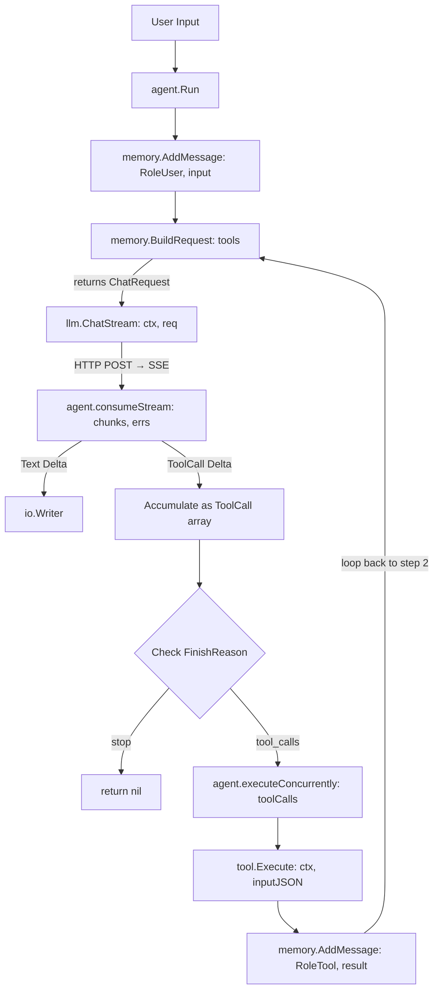
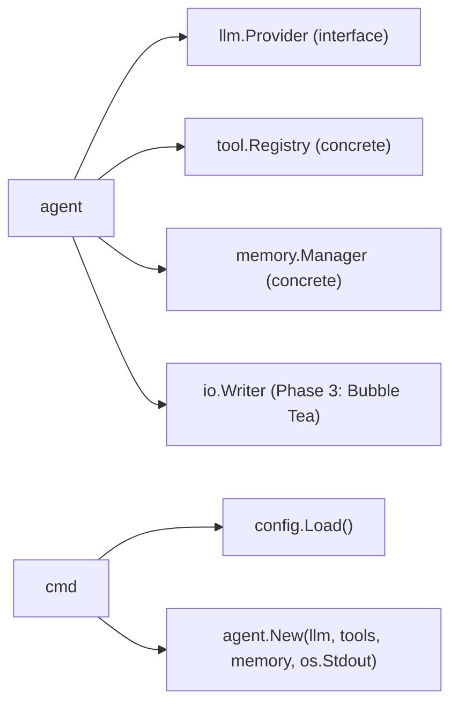

# Architecture Overview

## Module Map

## Data Flow (One ReAct Turn)

## Dependency Graph

Agent depends on three replaceable components (LLM Provider, Tools, Output target), the rest use concrete structs.

## Phase Mapping

| Phase | Modules Changed | Impact Scope |
|-------|-----------|---------|
| Phase 1 | All new | - |
| Phase 2 | `memory/` implements compression logic; `agent/` adds turn counter | local |
| Phase 3 | Add `tui/`; `cmd/` changes output implementation | agent code unchanged |
| Phase 4 | Add `mcp/`; `tool/` adds MCP adapter | injected via Tool interface |
